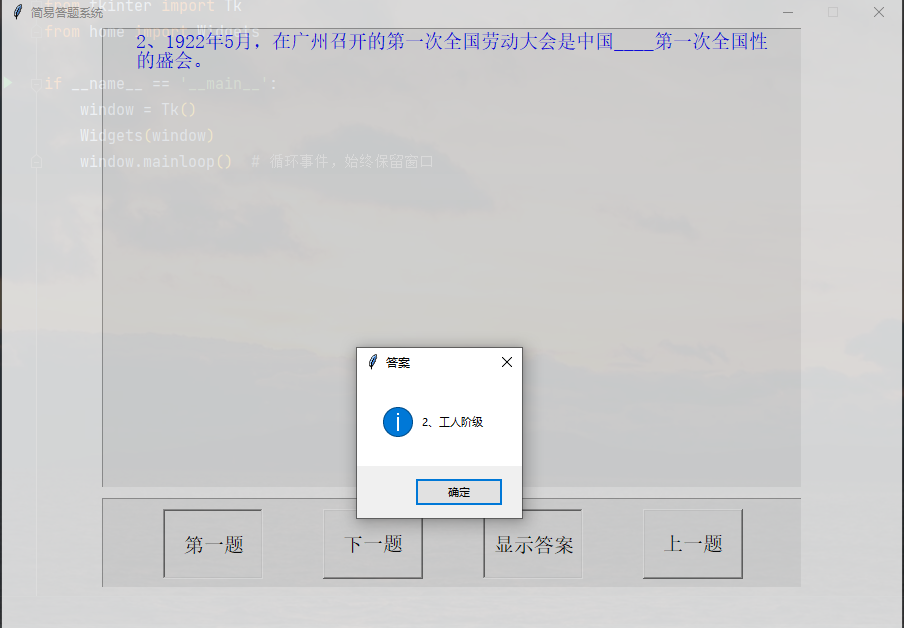
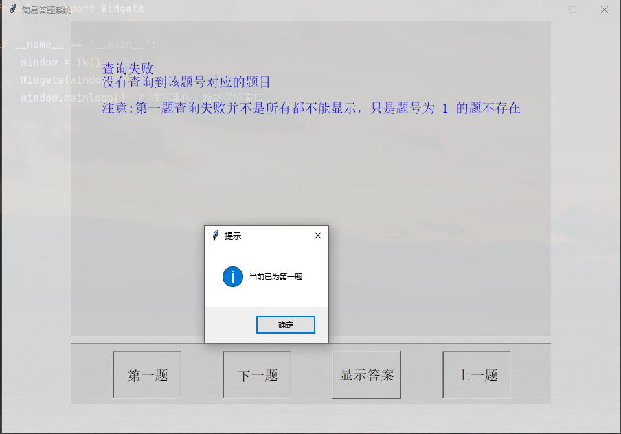
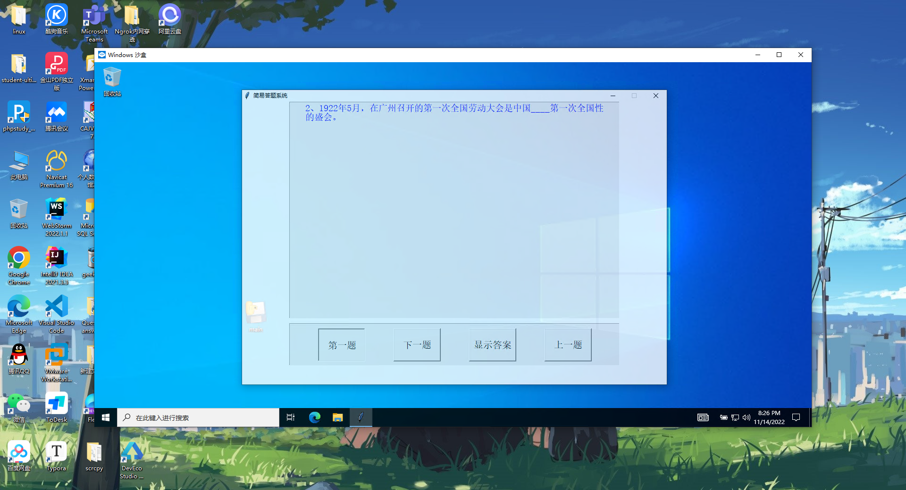

# 简易桌面端答题系统
## Simple Desktop Answering System with Tkinter 

## 简要介绍

这是一个简易桌面端答题系统，可以导入题库进行答题。

麻雀虽小，五脏俱全。

界面比较简单，但可以实现一个答题系统的基本要求。

## 安装模块

项目所依赖的第三方库环境及版本(安装最新的版本应该也不会出问题)，

已经导出至 `requirements.txt`文件

可以直接通过`pip` 命令安装依赖

- `pip install -r requirements.txt`

- `pip3 install -r requirements.txt`

## 启动准备

项目启动之前，应先配置数据库连接。

打开项目中的`db.py`模块文件,

将文件开头的 `host`等数据库连接参数修改为个人数据库参数

## 启动项目

- 在连接的`MySQL 8.0` 数据库下新建初始化数据库

```MySQL 
# utf8mb4 才是MySQL里真正的UTF-8
CREATE TABLE IF NOT EXISTS answering_system CHARACTER SET utf8mb4
```

- 执行`as.sql`脚本，初始化数据库

- 后续可以通过`Navicat`等数据库管理工具将Excel数据导入数据库

<p style="text-align:center">
	
    <br><br>
    
     <br><br>
    
</p>
​	
